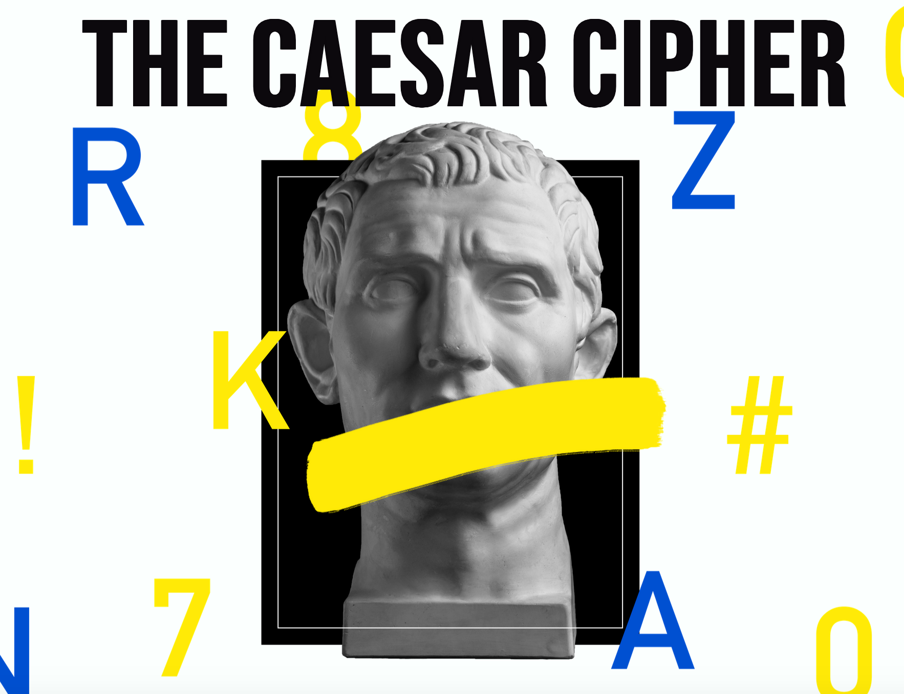

An app created with JavaScript, JQuery, HTML5 and CSS3 that allows users to encode and decode a message using the ancient Caesar cipher system.

Goals:
1. Redesign of app and layout (colors, style, button design, etc...)
2. Implement functionality to allows users to tweet their encoded messages.
